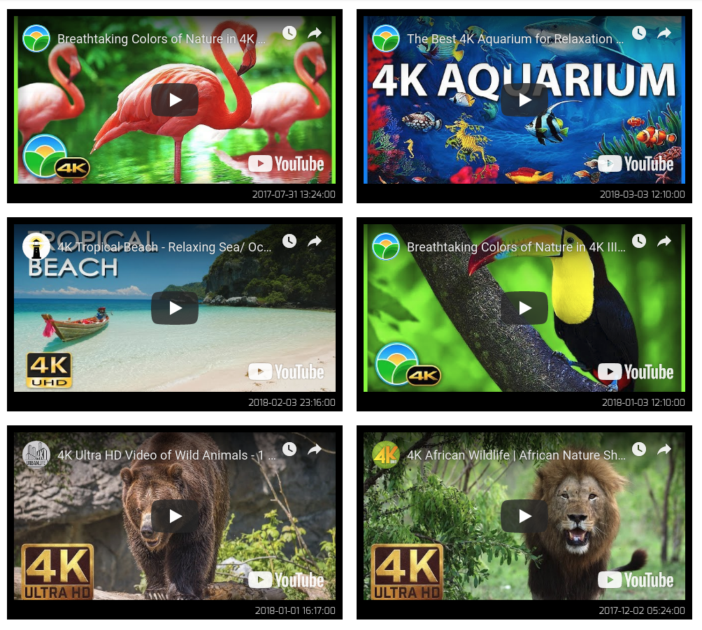

## **`!РЕШЕНО! «HOC — Higher Order Components». Все задачи`**  
### Задачи разделены по компонентам в папке components

---

### Ссылкка на [github-pages](https://rt-vinsent.github.io/ra16-hw-7/)

---

[](https://ci.appveyor.com/project/RT-Vinsent/ra16-hw-7)

[](https://github.com/RT-Vinsent/ra16-hw-7/actions/workflows/pages/pages-build-deployment)

---

HOC — Higher Order Components
===

Необходимо выполнить и предоставить на проверку следующие задачи:

<details>
<summary>1. Форматирование даты публикации.</summary>

## Форматирование даты публикации

Есть страница, содержащая список видеозаписей. 
У каждого блока есть дата публикации. 



В данный момент выводится просто текущее значение. Пример: `2017-09-01 14:15:10`. 
Решено изменять представление даты следующим образом в зависимости от его значения:
`12 минут назад`, если прошло меньше часа, `5 часов назад`, если прошло больше часа, `X дней назад`, если больше суток.

## Реализация

Используя HOC, обернуть `DateTime` в компонент `DateTimePretty` так, чтобы он преобразовывал дату в нужный вид.

Воспользуйтесь готовым файлом `App.js` и стилями `css/index.css` из каталога в качестве отправной точки. Замените ими те, что создаются в create-react-app.

Для работы с датой и временем можете воспользоваться библиотекой Moment.js.

</details>

<details>
<summary>2. Популярное и новое.</summary>

## Подсвечивание блоков

На нашем сайте есть блоки со статьями и с видеозаписями. 


Мы решили улучшить отображение наших блоков таким образом, чтобы популярные статьи и видео, у которых 1000+ прочтений или просмотров,
оборачивались в компонент `Popular`, а с количеством до 100 — в компонент `New`. Эти компоненты будут менять внешний облик блоков, привлекая внимание посетителей.

## Реализация

Используя HOC, обернуть `Video` и `Article` таким образом, чтобы при отображении в компоненте `List` они помещались внутрь требуемого компонента `Popular` или `New`.

Воспользуйтесь готовым файлом `App.js` и стилями `css/index.css` из каталога в качестве отправной точки. Замените ими те, что создаются в create-react-app.

</details>

<details>
<summary>3. Агрегация данных — необязательная задача.</summary>

## Агрегация данных для таблиц

Есть набор из трёх компонентов, которые выводят табличные данные: 
- с группировкой по месяцам за текущий год, 
- с группировкой по годам, 
- с сортировкой по убыванию. 


К сожалению, эти компоненты работают только с подготовленными данными, а API сервера статистики возвращает нам сырые данные — неотсортированные и несгруппированные.

Данные запрашиваются один раз (https://raw.githubusercontent.com/netology-code/ra16-homeworks/master/hoc/aggregation/data/data.json) — после загрузки страницы.
```js
{
  "list": [
    {"date": "2018-01-13", "amount": 10},
    {"date": "2018-02-13", "amount": 9},
    {"date": "2018-01-09", "amount": 5},
    {"date": "2017-12-14", "amount": 14},
    {"date": "2018-03-01", "amount": 13},
    //...
  ]
}
```

## Реализация

Обернуть компоненты таблиц в HOC, который бы производил над данными операции, приводящие их к нужному виду.
Также данные, которые группируются по дате, должны быть отсортированы по ней.

Компонент `MonthTable` ожидает данные в свойство `list` в следующем формате: 
```js
[{month: "Jan", amount: 100}, ...]
```

Компонент `YearTable` ожидает данные в свойство `list` в следующем формате: 
```js
[{year: 2018, amount: 100}, ...]
```

Компонент `SortTable` ожидает данные в свойство `list` в следующем формате: 
```js
[{date: "2017-12-14", amount: 14}, ...]
```

Воспользуйтесь готовым файлом `App.js` и стилями `css/index.css` из каталога в качестве отправной точки. Замените ими те, что создаются в create-react-app.


</details>

---

</br>

Все три задачи лучше сдавать в разных репозиториях, то есть через create-react-app реализовать три проекта, чтобы не было конфликта стилей. Но если вы позаботитесь о том, что конфликта не будет, то можете сдавать и в одном проекте.

**Обратите внимание**: в файлах `App.js` расположено несколько компонентов не потому, что так нужно делать, а чтобы вам было удобнее копировать. Будет хорошо, если в своём решении вы разнесёте их по разным файлам.
